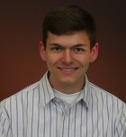

{:.center}
# Research Group #
 
## Post-Doctoral Researcher ##

<table width="100%">
<tr>
<td align="left" width="75%" style="vertical-align:top">
<h3>Xiaojing Xu Ph.D.</h3>
 
    Xiaojing is a social psychologist by training, and is committed to promoting better decision-making for individuals, organizations, and societies.
    Her specialties include survey and experiment design, data analytics, statistical modeling and estimation, etc.

    She is a keen learner of new knowledge and skills and a firm believer in interdisciplinary collaboration. She has been involved in multiple projects
    across psychology, communication, business, and electrical engineering.
</td>
<td align="right" width="25%" style="vertical-align:top">
    
</td>
</tr>
</table>
 

## Undergraduate Research Assistants ##

<table width="100%">
<tr>
<td align="left" width="75%" style="vertical-align:top">
<h3>Alyssa Loveday</h3>
<i class="fa fa-file-text fa-fw"></i> Curriculum Vitae, <a href= "/assets/lib/Loveday_Resume.pdf" > pdf </a> 
 
    Alyssa is a current senior at The University of Tennessee, Knoxville, double majoring in Psychology and Sustainability.
    Since a young age, she has always found enjoyment in being outside and learning more about human cognition, so she is thankful for the opportunity
    to apply her two passions towards an academic education. She has traveled outside of the country numerous times and find true excitement in being
    surrounded by unfamiliar and culturally diverse areas. Upon graduation, She plans on working for the Americorps and then continuing her education towards
    a PhD in Environmental Psychology.
</td>
<td align="right" width="25%" style="vertical-align:top">
    <!-- style="width:140px;height:154px;">     -->
</td>
</tr>
</table>
 

<table width="100%">
<tr>
<td align="left" width="75%" style="vertical-align:top">
<h3>Jacqueline Adams</h3>
<i class="fa fa-file-text fa-fw"></i> Curriculum Vitae, <a href= "/assets/lib/Adams_CV.pdf" > pdf </a> 
 
    Jacqueline is a graduate of the University of Tennessee class of 2017. She has a degree in Honors Psychology and a minor in Political Science. She has been working for CURENT since January of 2016. In addition to her passion for researching the social-psychological determinants of energy saving, she is also interested in the intersection between her major and minor. She recently conducted research on ambivalence and voter behavior in the 2016 presidential election for her undergraduate honors thesis. She is currently studying to attend law school next fall.
</td>
<td align="right" width="25%" style="vertical-align:top">
    
</td>
</tr>
</table>
 

<table width="100%">
<tr>
<td align="left" width="75%" style="vertical-align:top">
<h3>Taylor Woodward</h3>
<i class="fa fa-file-text fa-fw"></i> Curriculum Vitae, <a href= "/assets/lib/Woodward_CV.pdf" > pdf </a> 
 
    Taylor is a current Junior at The University of Tennessee studying Industrial and Systems Engineering. She has been involved with CURENT since
     2015 working as both a student ambassador and undergraduate research assistant. Her research focuses on connecting social aspects and human factors to the
     technology of smart home energy management systems and demand response programs. Other interests include traveling, psychology, and promoting women involvement
     in STEM.
</td>
<td align="right" width="25%" style="vertical-align:top">
    
</td>
</tr>
</table>
 

<table width="100%">
<tr>
<td align="left" width="75%" style="vertical-align:top">
<h3>Faiza Islam</h3>
<i class="fa fa-file-text fa-fw"></i> Curriculum Vitae, <a href= "/assets/lib/Islam_CV.pdf" > pdf </a> 
 
    Faiza is a sophomore studying Industrial Engineering at The University of Tennessee. She is from Knoxville, TN and is so glad that she chose to attend UT.
    She is involved with the Society of Women Engineers and CURENT. Currently, she is working with Dr. Chen and helping her with her research. Faiza's interests
    include health and fitness and outdoor activities.
</td>
<td align="right" width="25%" style="vertical-align:top">
    
</td>
</tr>
</table>
 

<table width="100%">
<tr>
<td align="left" width="75%" style="vertical-align:top">
<h3>Roy Tan</h3>
<i class="fa fa-file-text fa-fw"></i> Curriculum Vitae, <a href= "/assets/lib/RoyTanResume.pdf" > pdf </a> 
 
   Roy is currently a Freshman in the University of Tennessee at Knoxville studying Electrical Engineering while also being a part of the Chancellor’s Honors Program
   and the Engineering Honors program. He is from Nashville Tennessee, and his interests include practicing instruments and outdoor activities such as hiking. He also
   takes part in UTK’s IEEE Robotics team and ASME robotic and drone design team since his goal is a career in robotics.
</td>
<td align="right" width="25%" style="vertical-align:top">
    
</td>
</tr>
</table>
 

<table width="100%">
<tr>
<td align="left" width="75%" style="vertical-align:top">
<h3>Brian Lundell</h3>
<i class="fa fa-file-text fa-fw"></i> Curriculum Vitae, <a href= "/assets/lib/Lundell_CV.pdf" > pdf </a> 
 
   Brian is a freshman at the University of Tennessee Knoxville studying Electrical Engineering. Born and raised in Knoxville, he was indoctrinated into becoming a Vol For
   Life. His interests include cybersecurity and semiconductor design. He works with CURENT and the IEEE student chapter to further his interests outside of class.
</td>
<td align="right" width="25%" style="vertical-align:top">
    
</td>
</tr>
</table>
 

<table width="100%">
<tr>
<td align="left" width="75%" style="vertical-align:top">
<h3>Sean Indelicato</h3>
<i class="fa fa-file-text fa-fw"></i> Curriculum Vitae, <a href= "/assets/lib/Indelicato_CV.pdf" > pdf </a> 
 
   Sean in a freshman studying Electrical Engineering at the University of Tennessee, Knoxville. He’s from Sevierville, Tennessee and is involved with CURENT, IEEE Robotics, and represents the Tickle College of Engineering as a student ambassador. He also enjoys tennis, ultimate Frisbee, and Super Smash Bros on the Nintendo Wii.
</td>
<td align="right" width="25%" style="vertical-align:top">
    
</td>
</tr>
</table>
 

<table width="100%">
<tr>
<td align="left" width="75%" style="vertical-align:top">
<h3>James Brannon</h3>
<!--<i class="fa fa-file-text fa-fw"></i> Curriculum Vitae, <a href= "/assets/lib/Indelicato_CV.pdf" > pdf </a> -->
 
   James is a senior at the University of Tennessee, Knoxville, majoring in Statistics with a minor in Economics. He is an Eagle Scout and has loved the outdoors since he was little, so being able to work research power systems in an analytical role seemed like a natural fit. Upon graduation, he plans on traveling for a year before returning to graduate school to pursue his Masters in Statistics and an MBA. He plans on working in nonprofits as an analyst.
</td>
<td align="right" width="25%" style="vertical-align:top">
    
</td>
</tr>
</table>
 

<table width="100%">
<tr>
<td align="left" width="75%" style="vertical-align:top">
<h3>Taylor Duncan</h3>
<i class="fa fa-file-text fa-fw"></i> Curriculum Vitae, <a href= "/assets/lib/Duncan_CV.pdf" > pdf </a> 
 
   Taylor is a senior at the University of Tennessee, Knoxville, majoring in Psychology and minoring in Religious Studies. She was born and raised in Memphis, TN, and loves being a Vol. Her research interests include resilience and psychopathology, which she hopes to pursue in graduate school. She has worked as a Resident Assistant and a Research Assistant on campus for the past two years and started at CURENT in July of 2017. Other interests include travel, reading, and finding good places to eat.
</td>
<td align="right" width="25%" style="vertical-align:top">
    
</td>
</tr>
</table>
 
{:.center}
