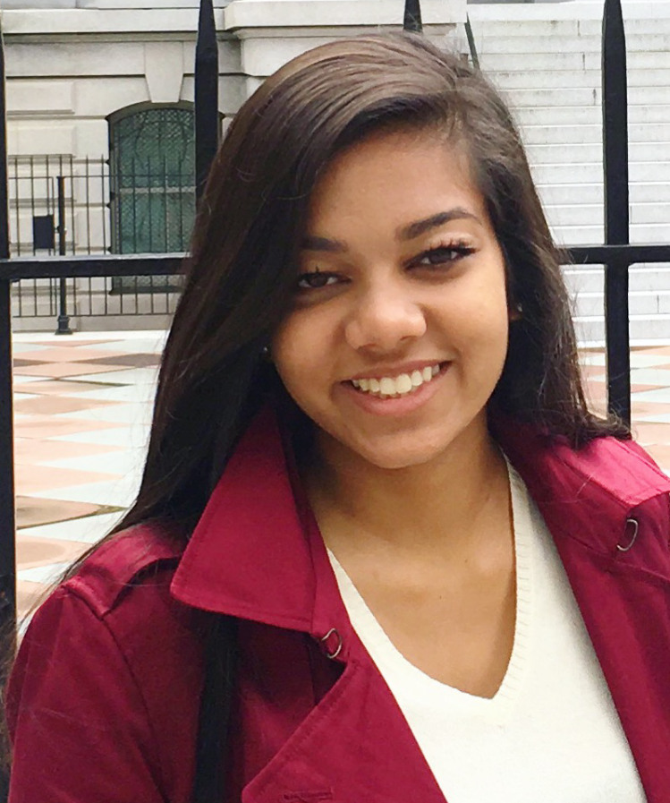

{:.center}
# Research Group #

## Post-Doctoral Researcher ##

  

    <h3>Xiaojing Xu, Ph.D.</h3>
    
 Xiaojing is a social psychologist by training, and is committed to promoting better decision-making for individuals, organizations, and societies. 
    Her specialties include survey and experiment design, data analytics, statistical modeling and estimation, etc. 

    She is a keen learner of new knowledge and skills and a firm believer in interdisciplinary collaboration. She has been involved in multiple projects 
    across psychology, communication, business, and electrical engineering.

  

  

    
  

### Xiaojing Xu Ph.D.###
<table width="100%">
<tr>
<td align="left">
    Xiaojing is a social psychologist by training, and is committed to promoting better decision-making for individuals, organizations, and societies. 
    Her specialties include survey and experiment design, data analytics, statistical modeling and estimation, etc. 

    She is a keen learner of new knowledge and skills and a firm believer in interdisciplinary collaboration. She has been involved in multiple projects 
    across psychology, communication, business, and electrical engineering. 
</td>
<td align="right">
         
</td>
</tr>
</table>
 

## Undergraduate Research Assistants ##

### Alyssa Loveday ###
<i class="fa fa-file-text fa-fw"></i> Curriculum Vitae, <a href= "/assets/lib/Loveday_Resume.pdf" > pdf </a> 
<table width="100%">
<tr>
<td align="left">
    Alyssa is a current senior at The University of Tennessee, Knoxville, double majoring in Psychology and Sustainability. 
    Since a young age, she has always found enjoyment in being outside and learning more about human cognition, so she is thankful for the opportunity 
    to apply her two passions towards an academic education. She has traveled outside of the country numerous times and find true excitement in being 
    surrounded by unfamiliar and culturally diverse areas. Upon graduation, She plans on working for the Americorps and then continuing her education towards 
    a PhD in Environmental Psychology.
</td>
<td align="right">
         
</td>
</tr>
</table>

### Jacqueline Adams ###
<i class="fa fa-file-text fa-fw"></i> Curriculum Vitae, <a href= "/assets/lib/Adams_CV.pdf" > pdf </a> 
<table width="100%">
<tr>
<td align="left">
    Jacqueline is a senior at the University of Tennessee majoring in Psychology and minoring in Political Science in the Chancellor’s 
    Honors Program. Her research interests lie in the intersection between her major and minor. She is currently writing a senior thesis on ambivalence 
    and voting intentions of US citizens in the 2016 presidential election. Additionally, she works in the Center for the Study of Youth in Political 
    Conflict and researches the roots of political conflict on the Gaza Strip. Jacqueline is pre-law and hopes to study international relations in Law School, 
    and she is also interested in pursuing her PhD in psychology. She started working for CURENT in the January of 2016.
</td>
<td align="right">
         
</td>
</tr>
</table>

### Taylor Woodward ###
<i class="fa fa-file-text fa-fw"></i> Curriculum Vitae, <a href= "/assets/lib/Woodward_CV.pdf" > pdf </a> 
<table width="100%">
<tr>
<td align="left">
    Taylor is a current Junior at The University of Tennessee studying Industrial and Systems Engineering. She has been involved with CURENT since
     2015 working as both a student ambassador and undergraduate research assistant. Her research focuses on connecting social aspects and human factors to the 
     technology of smart home energy management systems and demand response programs. Other interests include traveling, psychology, and promoting women involvement 
     in STEM.
</td>
<td align="right">
         
</td>
</tr>
</table>

### Faiza Islam ###
<i class="fa fa-file-text fa-fw"></i> Curriculum Vitae, <a href= "/assets/lib/Islam_CV.pdf" > pdf </a> 
<table width="100%">
<tr>
<td align="left">
    Faiza is a sophomore studying Industrial Engineering at The University of Tennessee. She is from Knoxville, TN and is so glad that she chose to attend UT. 
    She is involved with the Society of Women Engineers and CURENT. Currently, she is working with Dr. Chen and helping her with her research. Faiza's interests 
    include health and fitness and outdoor activities.
</td>
<td align="right">
         
</td>
</tr>
</table>

### Roy Tan ###
<i class="fa fa-file-text fa-fw"></i> Curriculum Vitae, <a href= "/assets/lib/RoyTanResume.pdf" > pdf </a> 
<table width="100%">
<tr>
<td align="left">
   Roy is currently a Freshman in the University of Tennessee at Knoxville studying Electrical Engineering while also being a part of the Chancellor’s Honors Program 
   and the Engineering Honors program. He is from Nashville Tennessee, and his interests include practicing instruments and outdoor activities such as hiking. He also 
   takes part in UTK’s IEEE Robotics team and ASME robotic and drone design team since his goal is a career in robotics. 
</td>
<td align="right">
         
</td>
</tr>
</table>

### Brian Lundell ###
<i class="fa fa-file-text fa-fw"></i> Curriculum Vitae, <a href= "/assets/lib/Lundell_CV.pdf" > pdf </a> 
<table width="100%">
<tr>
<td align="left">
   Brian is a freshman at the University of Tennessee Knoxville studying Electrical Engineering. Born and raised in Knoxville, he was indoctrinated into becoming a Vol For 
   Life. His interests include cybersecurity and semiconductor design. He works with CURENT and the IEEE student chapter to further his interests outside of class.
</td>
<td align="right">
         
</td>
</tr>
</table>
{:.center}