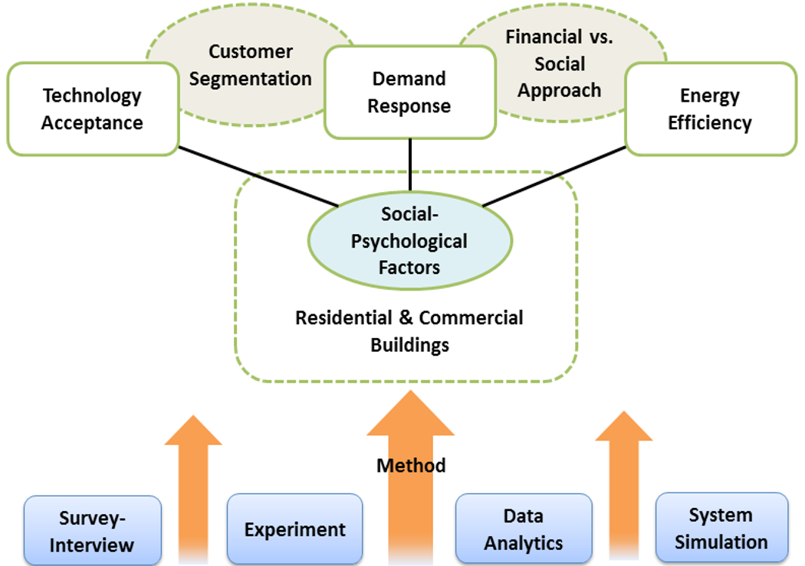

# Research #

## Social Behavioral Analysis for Demand Response, Renewable Technology and Energy Efficiency ##
<i class="fa fa-file-text fa-fw"></i> Fact Sheet, <a href= "/assets/lib/Chen Fact Sheet 07 2016 Social  Analysis.pdf"> pdf </a> 

### Overview and Goals ###

CURENT’s social behavioral research applies social-psychology theories and approaches to facilitate engineering research on improving power grid stability, 
renewable energy penetration and energy efficiency. Goals include:
 

+ Fostering interdisciplinary research from the areas of power systems, renewable energy, demand response (DR), occupant behaviors and social psychology. 
+ Integrating social-psychological factors and decision-making processes into engineering modeling to better understand demand response, customer segmentation, and acceptance of renewable energy and smart home management systems. 
+ Analyzing occupant behaviors in commercial buildings to improve energy efficiency based on group and organizational theories and occupant modeling. 
+ Providing fundamental knowledge to industry and policy makers.

### Impact ###

+ Help policy makers, industry, and researchers understand the social and human factors involved in load control and technology adoption.  
+ Develop updated demand response and energy efficiency solutions for industry. 
+ Identify new research topics in the areas of energy and social science. Build communications within and beyond CURENT, and provide engineering students with a broader viewpoint.

### Network and Collaborations ###

+ NSF RCN-SEES: [Predictive Modeling Network for Sustainable Human-Building Ecosystems (SHBE)](http://www.shbe.org/)
+ [International Energy Agency (IEA), Enerygy in Buildings and Communities (EBC), EBC Annex 66: Definition and Simulation of Occupant Behavior in Buildings](http://www.iea-ebc.org/projects/ongoing-projects/ebc-annex-66/).
+ [Advanced Collaborative Research Organization for Smart Society (ACROSS), Waseda University, Japan](http://www.waseda.jp/across/en/top/). (ACROSS)

### Major Projects in Process ###

1. *Acceptance of Smart Meter Technology* 
2. *Demand Response Incentives and Customer Segmentation*
3. *Occupant Behavior and Energy Use in Commercial Buildings*

More information on these projects can be found on the fact sheet at the top of the page.

